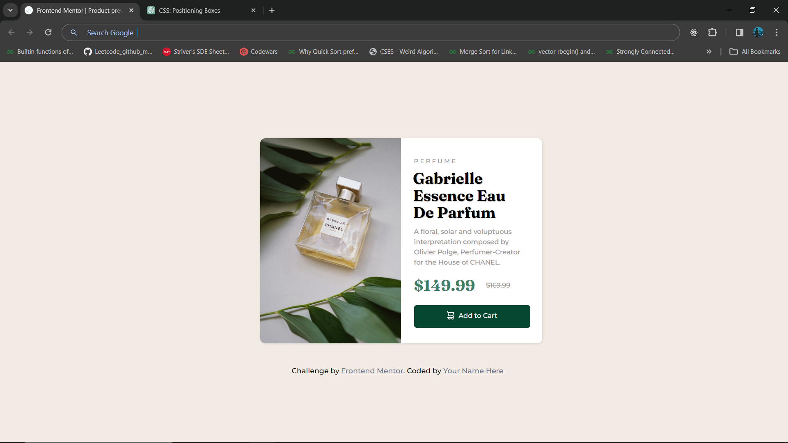

# Frontend Mentor - Product preview card component solution

This is a solution to the [Product preview card component challenge on Frontend Mentor](https://www.frontendmentor.io/challenges/product-preview-card-component-GO7UmttRfa). The website is fully responsive!!

## Table of contents

- [Overview](#overview)
  - [The challenge](#the-challenge)
  - [Screenshot](#screenshot)
  - [Links](#links)
- [My process](#my-process)
  - [Built with](#built-with)
  - [What I learned](#what-i-learned)
  - [Useful resources](#useful-resources)
- [Author](#author)

## Overview

### The challenge

Users should be able to:

- View the optimal layout depending on their device's screen size
- See hover and focus states for interactive elements

### Screenshot

### Links

- Live Site URL: [Add live site URL here](https://shubham-kpl.github.io/product-preview-card-component-main/)

## My process

### Built with

- Semantic HTML5 markup
- CSS custom properties
- Flexbox
- CSS Grid

### What I learned

I learnt to use CSS position and grid properties through this challenge

### Useful resources

- [ChatGPT](https://chat.openai.com) - Used it wherever I got stuck or felt lesser at concepts.

## Author

- LinkedIn - [Shubham Kandpal](https://www.linkedin.com/in/shubham-kandpal-59870322a)
- Frontend Mentor - [@Shubham-kpl](https://www.frontendmentor.io/profile/Shubham-kpl)
- Twitter - [@Shubham27200503](https://www.twitter.com/Shubham27200503)
